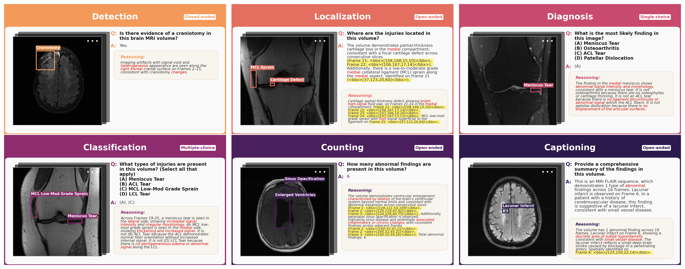
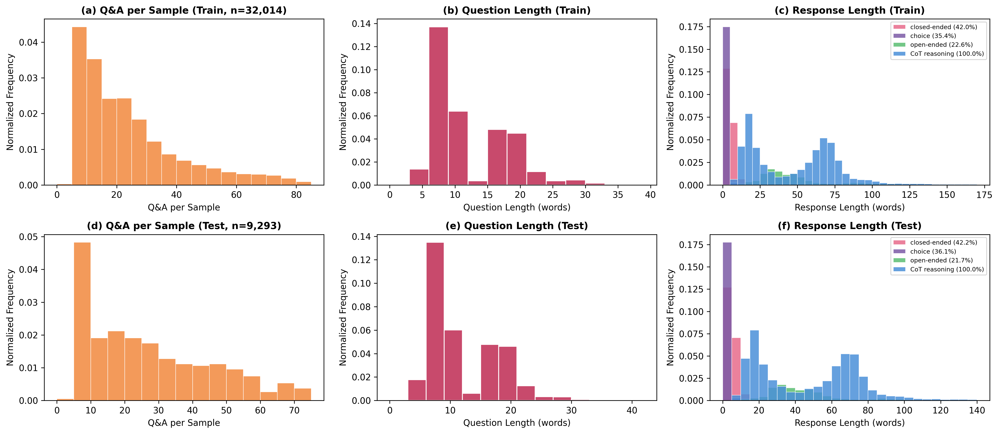
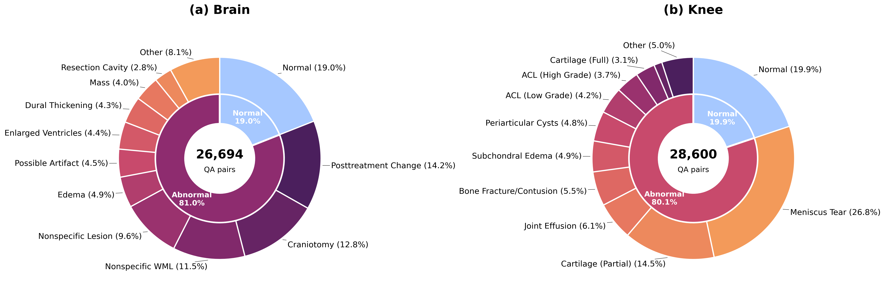

# Beyond a Single Frame: A Benchmark for Multi-Frame Spatially Grounded Visual Reasoning for MRI

<p align="center">
  <a href="https://arxiv.org/abs/2512.16301">Paper (arXiv)</a> &nbsp;&middot;&nbsp;
  <a href="https://lamawmouk.github.io/SGMRIQA">Project Page</a> &nbsp;&middot;&nbsp;
  <a href="https://huggingface.co/lamamkh/Qwen3-8B-SGMRIQA-SFT">Model Weights</a>
</p>

<p align="center">
  <b>Lama Moukheiber</b><sup>1</sup> &middot;
  <b>Caleb M. Yeung</b><sup>1,2</sup> &middot;
  <b>Haotian Xue</b><sup>1</sup> &middot;
  <b>Alec Helbling</b><sup>1</sup> &middot;
  <b>Zelin Zhao</b><sup>1</sup> &middot;
  <b>Yongxin Chen</b><sup>1</sup>
</p>

<p align="center">
  <sup>1</sup>Georgia Institute of Technology &nbsp;&nbsp;
  <sup>2</sup>Harvard University
</p>


SGMRI-VQA is a benchmark for evaluating how well VLMs spatially ground findings in volumetric medical images, where reasoning must extend across dozens of sequential slices.

- **41,307 QA pairs** across brain and knee MRI with frame-indexed bounding boxes and chain-of-thought reasoning
- **Hierarchical tasks**: detection &rarr; localization &rarr; counting/classification &rarr; captioning
- **Three metrics**: A-Score (answer accuracy), AR-Score (reasoning quality via GPT-4o judge), V-Score (mIoU spatial grounding)
- **10 VLMs benchmarked** (3 proprietary, 7 open-source) at image-level and volume-level
- **Fine-tuning Qwen3-VL-8B** with bounding box supervision closes the grounding gap

<p align="center">
  
</p>

## Results

All values in %. Best in **bold**, second best in <ins>underline</ins>.

### Image-Level

| Model | Detection | Classification | Diagnosis | Localization (V) | Localization (AR) | Captioning | Avg. |
|-------|:---------:|:--------------:|:---------:|:-----------------:|:------------------:|:----------:|:----:|
| GPT-4o | 50.74 | 52.49 | 44.71 | 3.41 | 26.22 | 16.90 | 32.41 |
| Gemini-2.5-Pro | 19.24 | 31.33 | 34.32 | 3.33 | 14.89 | 11.91 | 19.17 |
| Gemini-2.5-Flash | <ins>67.36</ins> | <ins>86.31</ins> | <ins>89.68</ins> | <ins>5.95</ins> | <ins>27.85</ins> | <ins>21.72</ins> | <ins>49.81</ins> |
| LLaVA-Video-7B | 52.41 | 65.41 | 71.58 | 2.29 | 23.11 | 13.31 | 38.02 |
| Eagle2.5-8B | 26.94 | 57.55 | 61.39 | 2.59 | 23.98 | 15.41 | 31.31 |
| Qwen3-VL-8B | 46.11 | 76.02 | 80.29 | 3.11 | 24.55 | 19.86 | 41.66 |
| InternVL2.5-8B | 22.25 | 37.33 | 30.43 | 1.82 | 25.78 | 14.37 | 22.00 |
| Qwen2.5-VL-7B | 5.29 | 50.68 | 39.88 | 1.51 | 26.75 | 18.19 | 23.72 |
| LLaVA-Med-v1.5 | 6.90 | 85.36 | 59.18 | 0.00 | 23.43 | 12.20 | 31.18 |
| MedGemma-1.5-4B | 20.11 | 65.98 | 64.61 | 2.77 | 24.93 | 17.24 | 32.61 |
| **Ours** (Qwen3-VL-8B-FT) | **95.11** | **97.56** | **94.50** | **15.51** | **28.99** | **25.05** | **59.45** |

### Volume-Level

| Model | Detection | Counting | Classification | Localization (V) | Localization (AR) | Captioning | Avg. |
|-------|:---------:|:--------:|:--------------:|:-----------------:|:------------------:|:----------:|:----:|
| GPT-4o | 70.57 | <ins>35.97</ins> | 67.51 | 1.20 | <ins>24.83</ins> | 20.19 | <ins>36.71</ins> |
| Gemini-2.5-Pro | 16.03 | 4.08 | 28.21 | 0.26 | 12.42 | 12.71 | 12.29 |
| Gemini-2.5-Flash | 54.89 | 17.66 | 56.31 | <ins>1.83</ins> | 23.27 | <ins>22.27</ins> | 29.37 |
| Qwen3-VL-8B | 62.23 | 30.98 | 64.72 | 0.16 | 21.93 | 19.05 | 33.18 |
| Eagle2.5-8B | <ins>70.65</ins> | 16.30 | <ins>70.73</ins> | 0.02 | 19.07 | 16.20 | 32.16 |
| InternVL2.5-8B | 28.80 | 14.95 | 44.01 | 0.41 | 17.66 | 16.29 | 20.35 |
| LLaVA-Video-7B | 37.23 | 13.59 | 48.94 | 0.06 | 16.26 | 12.36 | 21.41 |
| Qwen2.5-VL-7B | 24.18 | 25.27 | 62.54 | 0.07 | 15.63 | 16.67 | 24.06 |
| **Ours** (Qwen3-VL-8B-FT) | **99.18** | **37.77** | **97.70** | **5.97** | **28.24** | **26.54** | **49.23** |

## Project Structure

```
SGMRIQA/
├── src/sgmriqa/              # Core evaluation framework
│   ├── config/               #   Path constants, model registry
│   ├── data/                 #   Data loader, prompt builder
│   ├── models/               #   Model runners (API + HF + vLLM)
│   ├── metrics/              #   A-Score, AR-Score, V-Score
│   ├── run_inference.py      #   Inference with checkpoint resume
│   ├── run_evaluation.py     #   Metric computation
│   └── aggregate_results.py  #   Leaderboard generation
├── scripts/
│   ├── preprocessing/        #   fastMRI+ data processing (brain + knee)
│   ├── generation/           #   GPT-4o QA pair generation
│   ├── cleaning/             #   Clinician-guided QA data cleaning
│   └── slurm/                #   HPC job scripts
├── tests/
├── pyproject.toml
└── README.md
```

## Setup

```bash
git clone https://github.com/lamawmouk/SGMRIQA.git
cd SGMRIQA
pip install -e ".[dev]"
```

Create a `.env` file with your API keys (for proprietary model inference and AR-Score evaluation):

```
OPENAI_API_KEY=your-key
GOOGLE_API_KEY=your-key
```

### Data

Data is not included in this repository. The benchmark is built from the [fastMRI+](https://github.com/microsoft-research/fastMRIplus) dataset with expert radiologist annotations spanning 1,970 MRI volumes.

Configure data paths via environment variables or place directories at the project root:

```bash
export SGMRIQA_DATA_ROOT=/path/to/mri/images           # default: ./data
export SGMRIQA_DATA_GENERATION=/path/to/qa_json_files   # default: ./data_generation
export SGMRIQA_DATA_PROCESSING=/path/to/volume_metadata # default: ./data_processing
export SGMRIQA_OUTPUT_DIR=/path/to/outputs              # default: ./outputs
```

<p align="center">
  
</p>

## Data Pipeline

### 1. Preprocessing

Extract annotated slices from raw fastMRI+ volumes:

```bash
# Brain MRI
bash scripts/preprocessing/brain/00_download_and_extract_all.sh
bash scripts/preprocessing/brain/01_extract_slices_with_annotations.sh
bash scripts/preprocessing/brain/02_split_by_modality.sh
python scripts/preprocessing/brain/03_generate_json_dataset.py

# Knee MRI
bash scripts/preprocessing/knee/00_download_and_extract_all.sh
bash scripts/preprocessing/knee/01_extract_slices_with_annotations.sh
python scripts/preprocessing/knee/03_generate_json_dataset.py
```

### 2. QA Generation

Generate question-answer pairs with GPT-4o:

```bash
python scripts/generation/generate_qa_gpt4o_brain.py
python scripts/generation/generate_qa_gpt4o_knee.py
```

### 3. Clinician-Guided Cleaning

Post-process QA data for spatial consistency, anatomical correctness, and reasoning completeness:

```bash
python scripts/cleaning/clean_brain_qa.py
python scripts/cleaning/clean_knee_qa.py
```

<p align="center">
  
</p>

## Evaluation

### Inference

```bash
# Single model, image-level
python -m sgmriqa.run_inference --models gpt-4o --datasets brain --eval-mode image

# Multiple models, video-level (volume)
python -m sgmriqa.run_inference --models gemini-2.5-flash qwen3-vl-8b --eval-mode video

# All modes
python -m sgmriqa.run_inference --models eagle2.5-8b --eval-mode all
```

Inference saves checkpoints every N samples for automatic resume on interruption.

### Metrics

```bash
# A-Score + V-Score (skip AR-Score for speed)
python -m sgmriqa.run_evaluation --models gpt-4o --eval-mode image --skip-ar

# Full evaluation with AR-Score (uses GPT-4o as judge)
python -m sgmriqa.run_evaluation --models gpt-4o --eval-mode all

# Aggregate into leaderboard
python -m sgmriqa.aggregate_results
```

### SLURM (HPC)

For running open-source models on GPU clusters:

```bash
bash scripts/slurm/submit_vqa_full_eval.sh
```

## Evaluated Models

| | Model | Params | Runner |
|---|-------|--------|--------|
| | **Proprietary** | | |
| 1 | GPT-4o | &mdash; | `api_openai.py` |
| 2 | Gemini 2.5 Pro | &mdash; | `api_gemini.py` |
| 3 | Gemini 2.5 Flash | &mdash; | `api_gemini.py` |
| | **Open-Source** | | |
| 4 | LLaVA-Video-7B | 7B | `llava_video_runner.py` |
| 5 | Eagle 2.5 | 8B | `eagle_runner.py` |
| 6 | Qwen3-VL | 8B | `qwen3_vl_runner.py` |
| 7 | InternVL 2.5 | 8B | `internvl_runner.py` |
| 8 | Qwen2.5-VL | 7B | `qwen2_vl_runner.py` |
| | **Medical** | | |
| 9 | LLaVA-Med v1.5 | 7B | `hf_llava_med.py` |
| 10 | MedGemma 1.5 | 4B | `hf_medgemma.py` |
| | **Fine-Tuned (Ours)** | | |
| 11 | [Qwen3-VL-8B-SGMRIVQA-SFT](https://huggingface.co/lamamkh/Qwen3-8B-SGMRIQA-SFT) | 8B | `qwen3_vl_runner.py` |

## Citation

```bibtex
@inproceedings{moukheiber2026sgmrivqa,
  title     = {Beyond a Single Frame: A Benchmark for Multi-Frame Spatially
               Grounded Visual Reasoning for {MRI}},
  author    = {Moukheiber, Lama and Yeung, Caleb M. and Xue, Haotian
               and Helbling, Alec and Zhao, Zelin and Chen, Yongxin},
  year      = {2025}
}
```

## License

MIT
